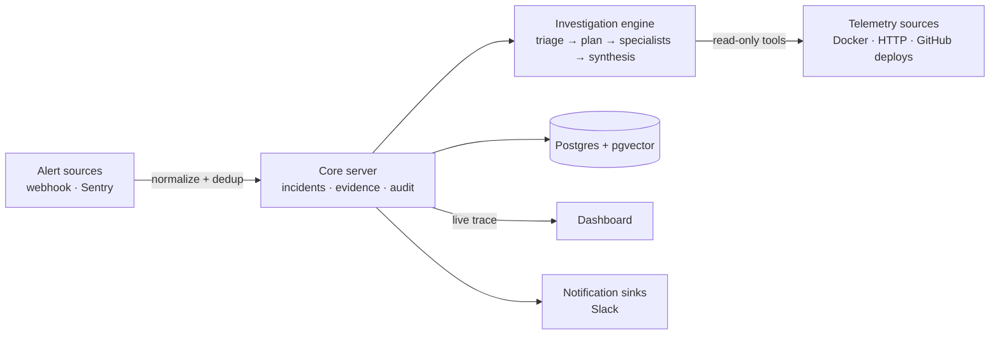

# Smokejumper

**The open-source AI incident copilot.** When an alert fires, an AI agent
investigates it the way a senior on-call engineer would — pulls logs, checks
infrastructure state, correlates symptoms across services — and delivers a
diagnosis with cited evidence to your dashboard in minutes, before a human
opens a laptop.

Smokejumpers are the firefighters who parachute in ahead of everyone else,
scout the fire, and report back. Same job.

- **Self-hosted.** Your telemetry never leaves your infrastructure. The only
  egress is the LLM API — and even that is optional (see the demo below).
- **Evidence or silence.** Every diagnosis claim cites immutable, hash-chained
  evidence records, or is explicitly labeled an unverified hypothesis.
- **Read-only.** The agent can look at anything and change nothing. Zero
  adoption risk.
- **Pluggable everywhere.** Alert sources, telemetry sources, and notification
  sinks are adapters against a stable SDK. The core doesn't know what
  "Sentry" is — it knows contracts.

## How it works



## The 5-minute demo

The repo ships its own fire to fight: a tiny shop (two services), a watchdog
that acts as your monitoring system, and a chaos CLI. You break the shop; the
watchdog notices real symptoms and fires an alert; Smokejumper investigates
while you watch the live trace.

No Anthropic API key needed: the default `.env` enables
`SMOKEJUMPER_FAKE_MODEL=1`, which runs the full investigation pipeline with
deterministic scripted model responses, entirely offline.

```bash
git clone https://github.com/artinrexhepi/smokejumper && cd smokejumper
cp .env.example .env && echo "SMOKEJUMPER_ENCRYPTION_KEY=$(openssl rand -base64 32)" >> .env
docker compose -f docker-compose.yml -f demo/docker-compose.yml up -d --build
```

Open <http://localhost:3000> and log in as `admin@example.com` /
`smokejumper`. Seeding is automatic — the org, project, and demo plugin
instances are created on first start.

Now break something:

```bash
pnpm install        # once, for the chaos CLI
pnpm chaos error-storm
```

(No Node on this machine? `curl -X POST localhost:3401/chaos/error-storm`
does the same thing.)

Within ~15 seconds the shop's error rate degrades, the watchdog fires a
webhook alert, an incident opens in the dashboard, and the live investigation
trace starts streaming. When the diagnosis card appears, judge it — confirm
or reject feeds the project's memory. Then heal the shop:

```bash
pnpm chaos reset
```

| Scenario | What breaks |
|---|---|
| `error-storm` | `/products` returns 500s; error rate degrades |
| `dependency-outage` | calls to the pricing worker time out; 502s |
| `latency` | `/products` takes 2–5s; health degrades on latency |
| `oom` | shop-api leaks memory until Docker OOM-kills it (256MB limit) and restarts it clean |
| `reset` | clears every injected failure |

The watchdog detects **symptoms** (error rates and latency derived from real
request outcomes, or an unreachable service), never the chaos switch itself —
what Smokejumper investigates is exactly what your monitoring would see.

### Real diagnoses

Set in `.env`:

```bash
SMOKEJUMPER_FAKE_MODEL=
ANTHROPIC_API_KEY=sk-ant-...
```

then `docker compose -f docker-compose.yml -f demo/docker-compose.yml up -d server`
to restart the server. The same chaos scenarios now get real model
investigations, including Docker container inspection through the bundled
read-only socket proxy.

### Running the core without the demo

`docker compose up -d --build` starts just Postgres, the server, the
dashboard, and the docker socket proxy. Seed the initial org and user with
`docker compose run --rm server node dist/seed.js`.

## Repository layout

| Path | What |
|---|---|
| `packages/plugin-sdk` | `@smokejumper/plugin-sdk` — the five plugin contracts, conformance suite, test fakes |
| `packages/db` | Postgres/pgvector data layer: incidents, hash-chained evidence, memory, audit |
| `packages/server` | Ingestion API, incident manager, REST + SSE |
| `packages/plugin-host` | Plugin registry, credential injection, read-only tool boundary |
| `packages/engine` | Mastra investigation workflow: triage → plan → specialists → synthesis |
| `plugins/*` | First-party adapters: webhook, Sentry, Docker, HTTP, GitHub deploys, Slack |
| `apps/dashboard` | Next.js dashboard: incident feed, live trace, diagnosis verdicts |
| `demo/` | The chaos harness you just ran |

## Building a plugin

Adapters are stateless objects against `@smokejumper/plugin-sdk`; config and
host capabilities are injected per call, so plugins never hold credentials:

```ts
import type { AlertSource } from '@smokejumper/plugin-sdk'

export const myAlertSource: AlertSource<{ token: string }> = {
  manifest: { id: 'my-source', kind: 'alert-source', /* ... */ },
  async verify(req, config) {
    return req.headers['x-my-token'] === config.token
  },
  normalize(payload) {
    return { title, severity, service, labels, dedupKey, occurredAt, raw: payload }
  },
}
```

The SDK ships a conformance suite (`checkAlertSource`, `checkTelemetrySource`,
`checkNotificationSink`) — the same certification tests first-party adapters
pass. See `packages/plugin-sdk/README.md`.

## Roadmap

- **Phase 1 — Foundation (now):** core server, plugin SDK, six adapters,
  investigation engine, dashboard, this demo.
- **Phase 2 — Cloud-native:** CloudWatch, Kubernetes, Prometheus/Loki,
  Alertmanager; full plugin management UI; OIDC; Helm chart.
- **Phase 3 — Depth:** Datadog, Grafana, Elasticsearch, PagerDuty; runbook
  RAG; post-incident reviews; community plugin registry.
- **Phase 4 — Autonomy:** approval-gated remediation with a policy engine.

## Development

```bash
pnpm install
pnpm test        # everything runs offline, including the e2e acceptance test
pnpm typecheck
./demo/smoke.sh  # optional: full docker-compose smoke (needs docker)
```

## License

MIT © Smokejumper contributors
